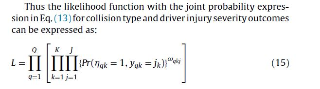

# Examining driver injury severity in two vehicle crashes- A copula based approach

**By Yasmin et al. (2014)**

[Paper link](https://github.com/subasish/MannBhat01/blob/master/Mannering_Bhat_Paper/Papers/MBRP%202014_6.pdf).

### What it is
* Each collision type has a fundamentally distinct effecton injury severity sustained in the crash. :sparkles:
* This study examines the hypothesis that collision typefundamentally alters the injury severity pattern under consideration.

### From Literature
* According to WHO:
> Road traffic crashes are one of the major causes of death in the world. The economic and societal cost, of road traffic crashes,accrues to billions of dollars. For example, in Australia,the total cost of motor vehicle crashes is estimated at approxi-mately $18 billion per annum.

### Dataset and Modeling

* A joint modeling framework to study collision type and injury severity sustained as two dimensions of theseverity process. 
* Employs **a copula based joint framework** that ties the collision type (representedas a _multinomial logit model_) and injury severity (represented as an _ordered logit model_) through aclosed form flexible dependency structure to study the injury severity process.
* Collision type as a vehicle-level
* Data for this empirical analysis are sourced from the Victoria crash database of Australia for the years **2006 through 2010**. For the five years, the crash database has a record of 67,809 crashes involving 118,842 motor vehicles and 166,040 individuals resulting in 1550 fatalities and 87,855 injuries to the crash victims.
* Used variables in the analysis – 
 1. driver characteristics, 
 2. vehicle characteristics, 
 3. roadway design attributes, 
 4. environmental factors and 
 5. crash characteristics.
* In terms ofmethodology, the analyst formulates and estimates a copula-based MNL-OL framework to jointly analyze the collision type and injury severity outcome in a two-vehicle crash.
* The empirical analysis involves estimation of models by using six different copula structures: (1) Gaussian, (2) FGM, 3) Clayton,(4) Gumbel, (5) Frank and (6) Joe.

### Important lines

> 1. The greater dissipation of kinetic energy associated with a head-on collision islikely to result in severe injuries compared to a side-swipe crash.
> 2. In a rear-end collision involving two vehicles, one of the vehicle will berear-ended and the other one will be the rear-ender. The driver of the rear-ended vehicle is likely to be pushed backward into the seat when struck by the rear-ender vehicle leading to a high probability of whiplash or neck injury due to the continuous movement of the neck at a different speed relative to the head and the rest of the body.
> 3. In this approach, **the analyst** imposes the assumption that the injury severity profile for vehicle occupants in all types of crashes is the same and any potential differencesbetween different collision types can be accurately captured by employing the collision type variable as an explanatory variable. :pushpin:

### Contributions
* Defines a vehicle level collision type variableusing a combination of collision type and the initial point of contact. 
* Develops a closed formcopula based framework to accommodate the impact of observedand unobserved effects on collision type and injury severity whilegenerating collision type as a vehicle level variable. 
* Formulates the copula model by incorporating parameterization of dependency profile in an unordered andordered joint structure. 

### Key Findings
> The model estimation results presented in the current paper suggest that the impact of exogenous variablesvary (for some variables) in magnitude as well as in sign acrosscollision types. The variables in moderating the effect of different collision types also reveal varying effects.
 

### Limitations
* No limitations are mentioned in the paper. That's a limitation. :no_mouth:
* Too many tables; Almost no graphics. :fire:
