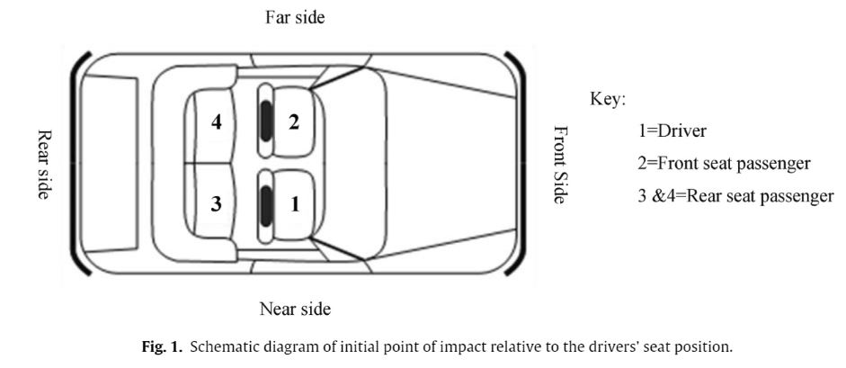

# Examining driver injury severity in two vehicle crashes- A copula based approach

**By Yasmin et al. 2014**

[Paper link](https://github.com/subasish/MannBhat01/blob/master/Mannering_Bhat_Paper/Papers/MBRP%202014_6.pdf).

## What's new

Two unique contributions:

1. XX
2. XX

The idea on high level is clear but the writing here is a bit unclear on details, of exactly how the sampling is done.

## The model

I find the paper's model description slightly wordy and unclear, but basically we're building a **differentiable nearest neighbor++**. The output \hat{y} for a test example \hat{x} is computed very similar to what you might see in Nearest Neighbors:

## The bad

1. All tables, no graphics
2. Hard to digest
3. Tons of tables