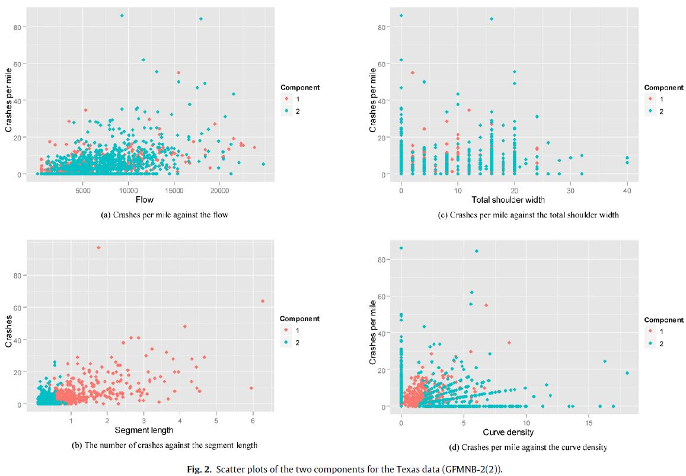

# Application of finite mixture of negative binomial regression models with varying weight parameters for vehicle crash data analysis

**By Zou et al. (2013)**

[Paper link](https://github.com/subasish/MannBhat01/blob/master/Mannering_Bhat_Paper/Papers/MBRP%202013_38.pdf).

### What it is
* Various studies suggest modeling the weight parameter as a function of the explanatory variables in the data. 
* This study investigates the differences on the modeling and fitting results between the **two-component finite mixture of NB regression models with fixed weight parameters (FMNB-2) and the two-component finite mixture of NB regression models with varying weight parameters (GFMNB-2)**, and compare the group classification from both models.

### Dataset and Modeling
* Two datasets were used. 
* The Toronto dataset contains crash data collected in 1995 at urban 4-legged signalized intersections in Toronto, Canada. 
* The Texas dataset was collected at 4-lane undivided rural segments in Texas. This dataset contains crash data collected on 1499 undivided rural segments over a five-year period from *1997 to 2001*. The segment length ranged from 0.10 to 6.275 miles, with an average of 0.55 miles. During the study period, 553 out of the 1,499 (37%) segments did not have any reported crashes, and a total of 4,253 crashes occurred on 946 segments.

### Important lines
> 1. Given the potential advantages of finite mixture models in describing the heterogeneity in crash data, there is a need to conduct further research on improving their performance. It is useful to understand what characteristics make a particular site more prone to fall into one or the other sub-population (i.e., one sub-population consists of accident-prone sites and the other contains low-risk sites).
> 2. Another point worth noting is that transportation safety analysts are recommended to evaluate different functional forms describing the weight parameter. The selection of the best functional form should be based on not only the goodness-of-fit statistics, but also the resulting classification. :pushpin:

### Contributions
* The GFMNB-2 models can provide more reasonable classification results, as well as better statistical fitting performance than the FMNB-2 models for both roadway segment crash data and intersection crash data
* The GFMNB-2 models can be used to better reveal the source of dispersion observed in the crash data than the FMNB-2 models.

### Key Findings
> The Texas data used in this study are highly dispersed. The FMNB-g model is recommended if the high dispersion is caused by the heterogeneity in the crash data (the crash data are suspected to consist of observations from several distinct sub-populations).

### Limitations
* From the study:
> Only limited explanatory variables are used to model the weight parameter and the selection of the functional form could significantly affect the modeling results, it is useful to further evaluate various functional forms for the weight parameter.
* Dataset is too old. :no_mouth:

