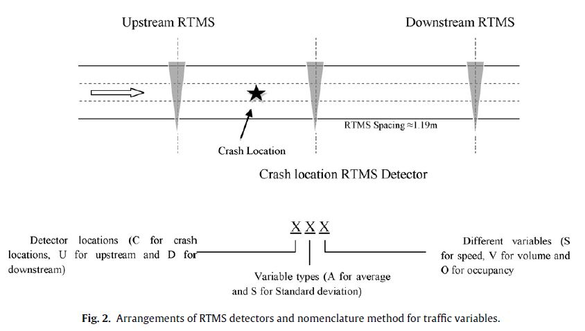

# Utilizing support vector machine in real-time crash risk evaluation

**By Yu and Abedel-Aty (2013)**

[Paper link](https://github.com/subasish/MannBhat01/blob/master/Mannering_Bhat_Paper/Papers/MBRP%202013_36.pdf).

### What it is
* Real-time crash prediction.
* More precise estimation using support vector machine (SVM).

### Dataset and Modeling
* The 15-mile mountainous freeway is located on I-70 in Colorado and the studied segment starts from the Mile Marker (MM) 205 and ends at MM 220. There were two datasets utilized in this study, (1) crash data from October 2010 to October 2011 provided by Colorado Department of Transportation (CDOT) and (2) real-time traffic data detected by 30 RTMS radars.
* There were 265 crashes documented and matched with the traffic data and 1017 non-crash cases that were matched with the crash cases.

### Important lines
> 1. From the results it can be concluded that for the model without variable selection, the SVM models for the training dataset have the over-fitting problem while for the scoring datasets it performed even worse than the traditional logistic regression models. So it is highly recommended that before formalizing SVM models, variable selection methodology would be implemented.:pushpin:
> 2. Although previous real-time crash risk evaluation models have been proven to be capable of differentiating between crash and non-crash cases, these models have some limitations. Logistic regression models assumed a linear relationship between the dependent and independent variables while neural network models work as a black-box and may have over-fitting issues.
> 3. As an emerging machine learning method, SVM was blamed for being a black-box technique whereas the effects of explanatory variables on the dependent variable could not be seen. However, with the benefits of sensitivity analysis, the relationships between crash occurrence and the chosen four explanatory variables could be analyzed.

### Contributions
* Used variable selection methods before conducting SVM
* Two-stage sensitivity analyses have been conducted to unveil the effects of the chosen explanatory variables on crash occurrence; by changing one explanatory variable with a pre-defined value and keeping the other variables with the original values, the effects of each explanatory variable can be revealed by comparing the mean crash occurrence probabilities.

### Key Findings
> Crashes are more likely to happen within the congested area, especially for the queuing area that propagates from downstream; large variation of
occupancy and volume indicates turbulent and stop-and-go traffic scenarios also have relatively high risk of crash occurrence.

### Limitations
* From the study:
> In this study, support vector machine (SVM), a recently proposed statistical learning model was introduced to evaluate real-time crash risk.
    * This line from the abstract is needed to be rephrased. SVM is not a recently proposed SLT. It was introduced by Vapnik in 1974.

